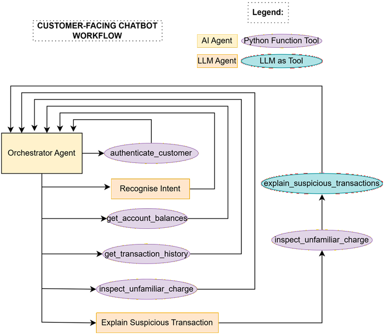
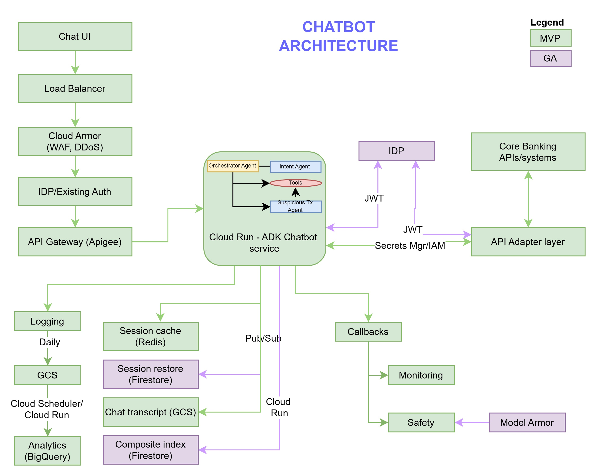

# Banking Chatbot — ADK Web

A customer-facing banking chatbot built with Google ADK. Supports balance enquiries, transaction history, and unfamiliar charge investigation.
Google ADK was chosen as the Agentic AI framework as ADK Web provides UI for quick prototyping and testing.

## Multi-Agent Design



## Agent Structure

```
bot/
├── agent.py                  ← ADK web entry point
├── orchestrator_agent/       ← Root agent — authenticates user and routes requests
│   ├── __init__.py
│   ├── agent.py
│   ├── description.md
│   └── instructions.md
├── intent_agent/             ← Classifies user intent
│   ├── __init__.py
│   ├── agent.py
│   ├── description.md
│   └── instructions.md
├── susp_tx_agent/            ← Explains unfamiliar/suspicious charges
│   ├── __init__.py
│   ├── agent.py
│   ├── description.md
│   └── instructions.md
├── description/              ← Design and architecture diagrams
│   ├── agent_components.png  ← Agent component breakdown
│   ├── architecture.jpg      ← System architecture diagram
│   ├── multi_agent_design.png ← Multi-agent workflow diagram
│   └── Results.xlsx          ← Test results
├── mcp_server.py             ← MCP server exposing banking tools
├── data.py                   ← In-memory customer, account and transaction data
├── model.py                  ← Gemini model configuration
├── tools.py                  ← Banking tools (auth, balance, transactions, charges)
├── pyproject.toml            ← Project dependencies
└── .env                      ← Environment configuration
```

## Architecture



## Prerequisites

- Python >= 3.10
- [uv](https://docs.astral.sh/uv/) (recommended) or pip
- A valid [Gemini API key](https://aistudio.google.com/apikey)

## Installation

From the `src/adk/bot/` directory:

```bash
# Using uv (recommended)
uv pip install -e .

# Or using pip
pip install -e .
```

This installs all dependencies from `pyproject.toml` and makes the `bot` package and all its sub-packages (`intent_agent`, `orchestrator_agent`, `susp_tx_agent`) available. Each sub-package has an `__init__.py` so they are correctly discovered and their `.md` instruction files are included.

Key dependencies:

| Package | Purpose |
|---|---|
| `google-adk >= 1.18.0` | Agent framework |
| `google-genai` | Gemini API client |
| `pandas >= 2.0.0` | In-memory data store |
| `pydantic >= 2.0.0` | Schema validation |
| `fastmcp` | MCP server for banking tools |

## Configuration

Create or update `src/adk/bot/.env`:

```
GOOGLE_GENAI_USE_VERTEXAI=0
GOOGLE_API_KEY=your-api-key-here
MODEL_NAME=your-model-name-here
```

> `GOOGLE_GENAI_USE_VERTEXAI=0` is required to use the Gemini API key directly instead of Vertex AI.

## MCP Server

Banking tools can be exposed via an MCP server (`mcp_server.py`) that ADK spawns automatically as a subprocess using `stdio` transport when the agent is loaded. The tools in `tools.py` are reused directly — `mcp_server.py` only registers them and not used in the solution. However to test the MCP server independently:

```bash
cd AgenticAI_Chatbot/bot
python bot/mcp_server.py
```

## Running with ADK Web

```bash
cd AgenticAI_Chatbot/bot
adk web
```

Then open `http://localhost:8000` in your browser and select `orchestrator_agent` from the agent dropdown.

## Test Credentials

| Customer ID | PIN | Accounts |
|---|---|---|
| CUST1001 | 1234 | Current (×4321), Savings (×9988) |
| CUST1002 | 4321 | Current (×1111) |

## Supported Intents

| Intent | Example |
|---|---|
| Authentication and Check balance | "My customer ID is CUST1001 and my PIN is 1234. What is my balance?" |
| Check transaction history | "What is the last transaction?" |
| Check unfamiliar charge | "What is the charge at Shell?" |
| Explain suspicious transaction | "I didn't go to Shell but why have I been charged?" |
| Not main intent (Complaint testing) | "I'm quite frightened and upset at this." |
| Not main intent (Out of scope testing) | "Do you often get such fraudulent transactions?" |
| Not main intent (Out of scope testing) | "Can you transfer £100 from this account to another of my account?" |
| Not main intent (Greeting testing) | "okay" |
| Not main intent (Reaffirmation testing) | "I'd like to know the last transaction of CUST1001" |
| Not main intent (Negative testing) | "I'd like to know the last transaction of CUST1002" |

## Features not implemented

Quite a few features have been left out due to limiation of time. They include:
1. Rate limiting (Attempted)
2. MCP server (Included but not used as more work is required to be done)
3. Enhanced logging
4. Enhanced Caching and memory management
5. Guardrails
6. Enhanced Context engineering - prompt tightening, skills etc.
7. Versioning
8. Monitoring
9. Security
10. Data ingestion (Pandas dataframe was used as stubs)
